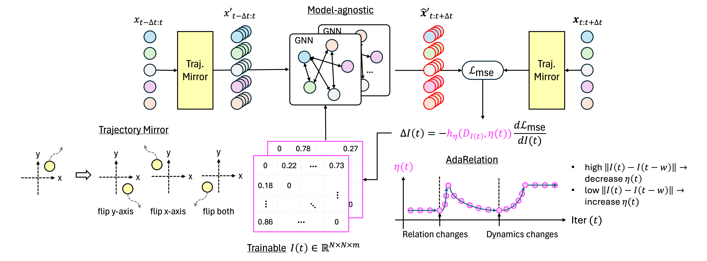

## Online Relational Inference for Evolving Multi-agent Interacting Systems ##


This is a temporary anonymous repository for NeurIPS submission #14488. To the best of our knowledge, this is the first open-source framework on online learning of multi-agent relational inference. It mainly includes ORI with NRIr decoder and ORI with MPMr decoder for now. Additional experimental details such as prior offline methods will be provided soon.

## Setup Environment
```bash
conda create -n ori python=3.8
conda activate ori
pip install torch==1.9.1+cu111 torchvision==0.10.1+cu111 -f https://download.pytorch.org/whl/torch_stable.html
pip install torchdiffeq==0.2.3
pip install torch_geometric==2.5.0
pip install torch-cluster==1.5.9 -f https://data.pyg.org/whl/torch-1.9.1+cu111.html
pip install torch-scatter==2.0.9 -f https://data.pyg.org/whl/torch-1.9.1+cu111.html
pip install torch-sparse==0.6.10 -f https://data.pyg.org/whl/torch-1.9.1+cu111.html
pip install tqdm==4.66.2
pip install matplotlib==3.0.3
pip install scikit-learn==1.3.2
```

## Setup Datasets

Data generation is primarily done by data/generate_dataset.py. Note, current npy files in data/evolving... are just examples to show name format, not actual training data.

To generate evolving interaction datasets (fixed parameter and no switching dynamics):
```bash
python generate_dataset.py --simulation springs --mode interaction
python generate_dataset.py --simulation charged --mode interaction
```

To generate evolving interaction + parameter datasets (variable parameter and no switching dynamics):
```bash
python generate_dataset.py --simulation springs --mode parameter
python generate_dataset.py --simulation charged --mode parameter
```

To generate evolving interaction + dynamics datasets (fixed parameter and switching dynamics), evolving interaction datasets should be prepared first. If they are ready:
```bash
python generate_evolving_dynamics.py
```


## Run Experiments
Please check ```os.environ["CUDA_VISIBLE_DEVICES"]``` in NRI/train.py and NRI-MPM/run.py to select device to run experiments.

Current args are set to enable Trajectory Mirror and AdaRelation by default. Ablation studies can be perfomed by turning off these arguments.

For NRI,
```bash
cd NRI
python train.py --dyn springs # evolving interaction
python train.py --dyn charged # evolving interaction
python train.py --dyn springs_var # evolving interaction + parameter
python train.py --dyn charged_var # evolving interaction + parameter
python train.py --dyn mixed # evolving interaction + dynamics
```

For MPM,
```bash
cd NRI-MPM
python run.py --dyn springs # evolving interaction
python run.py --dyn charged # evolving interaction
python run.py --dyn springs_var # evolving interaction + parameter
python run.py --dyn charged_var # evolving interaction + parameter
python run.py --dyn mixed # evolving interaction + dynamics
```

## Acknowledgements
This project is based on the following open-source projects. We thank their authors for making the source code publically available.

 - [NRI](https://github.com/ethanfetaya/NRI/tree/master)
 - [MPM](https://github.com/hilbert9221/NRI-MPM)

